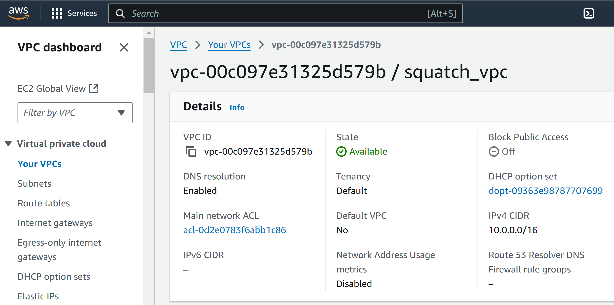
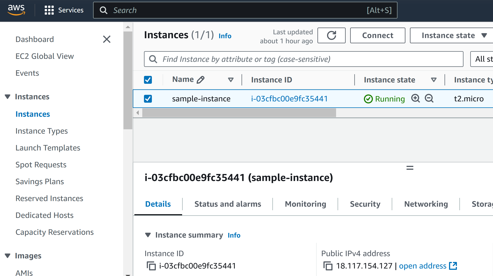

# AWS_Defense_in_Depth
This project demonstrates a defense in depth approach to securing cloud resources using AWS and Terraform.

## Table of Contents
* Overview
* Features
* Architecture
* Prerequisites
* Usage
* Project Structure
* License

## Overview
The AWS Defense in Depth Project applies best practices for securing AWS cloud environments. It includes:
  * A VPC with specified CIDR block.
  * Subnets in defined availability zones.
  * Security groups with tailored ingress and egress rules.
  * An internet gateway for internet access.
  * A route table associated with the subnet for access control.
  * EC2 instances in a Windows environment configured with RDP access from a specified IP address or CIDR block.
  * A generated RSA key pair with 2048 bits: public key generated into AWS Console and private key into working directory.
This setup demonstrates a layered approach to security and showcases how to manage resources as code with Terraform.

## Features
  1. Custom VPC:
     * CIDR block: 10.0.0.0/16
  2. Subnets:
     * Availability zone: us-east-2a
     * CIDR block: 10.0.1.0/24
  3. Security groups:
     * Ingress: RDP (3389) from trusted IP.
     * Egress: Open to all outbound traffic.
  4. Internet Gateway
     * Destination CIDR: 0.0.0.0/0.
  6. Route Table
     * Associated with VPC and Subnet CIDRs.
  7. EC2 Instance:
     * Launches in defined subnet.
     * Associated public IP for RDP.
  8. Key Pair
     * Private Key: Saved to specified filepath as .pem file.
       * RSA with 2048 bits (AWS default)
     * Public Key: Saved to AWS Console.

## Architecture
```
+------------------------------------------------+
|                    AWS Account                 |
+------------------------------------------------+
                       |
                       v
+------------------------------------------------+
|                     VPC                        |
|             CIDR: 10.0.0.0/16                  |
+------------------------------------------------+
                       |
       +---------------+---------------+
       |                               |
       v                               v
+-----------------------+   +-----------------------+
|   Public Subnet       |   |   Private Subnet      |
|   CIDR: 10.0.1.0/24   |   |   CIDR: 10.0.2.0/24   |
+-----------------------+   +-----------------------+
                       |
                       v
       +-------------------------------------+
       |          Internet Gateway           |
       +-------------------------------------+
                       |
                       v
       +-------------------------------------+
       |        Route Table:                 |
       |  Route: 0.0.0.0/0 → Internet Gateway|
       |  Associated Subnet: Public Subnet   |
       +-------------------------------------+
                       |
                       v
       +-------------------------------------+
       |      Security Group: "sg-name"      |
       |  Inbound Rules:                     |
       |    - RDP (TCP 3389): 0.0.0.0/0      |
       |  Outbound Rules:                    |
       |    - All Traffic: 0.0.0.0/0         |
       +-------------------------------------+
                       |
                       v
       +-------------------------------------+
       |        EC2 Instance                 |
       |    Type: t2.micro                   |
       |    Key Pair: "my-keypair"           |
       |    Subnet: Public Subnet            |
       |    Security Group: "sg-name"        |
       +-------------------------------------+

```
## Prerequitites
* Terraform: Installed on local machine (v1.5 or later recommended).
* AWS CLI: Installed and configured with credentials.
* Git: For version control.
* Access: An AWS with appropriate IAM permissions.
## AWS Console Screenshots
### VPC


### EC2 Instance

## Usage
* Clone the repository:
```
  git clone https://github.com/mrdobbs2010/AWS_Defense_in_Depth.git
  cd AWS_Defense_in_Depth
```
* Initialize Terraform
```
  terraform init
```

* Plan the Infrastructure

```
  terraform plan
```
* Apply the configuration and create the resources
```
  terraform apply
```
* Access the Instance
1. Navigate to AWS Console > EC2 > Instances. Click on the instance name generated and shown in Terraform.
2. Click the "Connect" button.
3. Choose the RDP Client tab.
4. Click "Download the Remote Desktop file." This can now be found in your "Downloads" folder.
5. Click "Get Password."
6. Be sure RSA is chosen. Browse and choose the .pem file for your secret password in your "Downloads" folder. (Or paste the contents manually)
7. Copy the password to use when you connect to the instance.
8. Open Remote Desktop Connection on your own computer. Click "Options" Dropdown.
9. Enter the DNS of the instance generated in VS.
10. Username: "Administrator."
11. Under the "Connections" section, click "Open" and choose the Remote Desktop file in your "Downloads" folder for the instance.
12. When the remote connection is complete, enter the password you decrypted and copied from your AWS Console.
13. Have fun using your remote desktop!

## Project Structure
```
AWS_Defense_in_Depth/
├── main.tf               # Main Terraform configuration
├── providers.tf          # Providers for the project
├── versions.tf           # Versions for Terraform and AWS
├── variables.tf          # Variables for the project
├── outputs.tf            # Outputs for public IP, VPC ID, etc.
├── README.md             # Documentation for the project
```
## License
This project is licensed under the MIT License. See the LICENSE{License} file for details.
